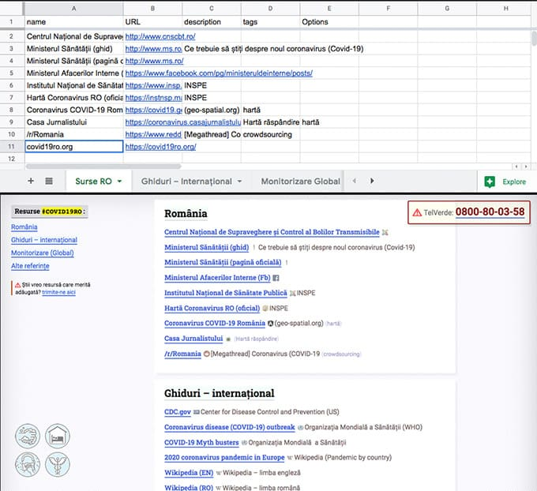
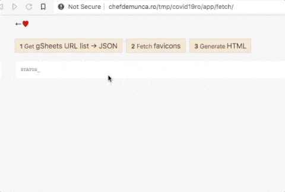

[gSheets](https://drive.google.com/open?id=1ditBRGTP7kIDHbqDpUF64JJK8-8ocdEex9-L76eeV1g) &rarr; [static HTML](https://pax.github.io/covid19ro/)

- columns: name, url,	description, tags, options – all optional (no _url_ wo _name_ tho)
- options: mark, inline, bold, alpha7 –> css classes 

